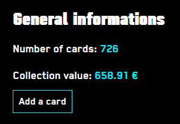
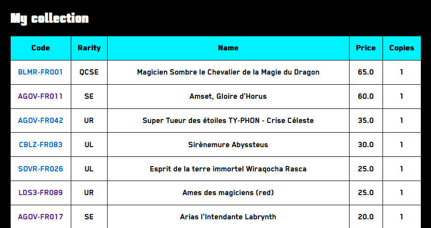
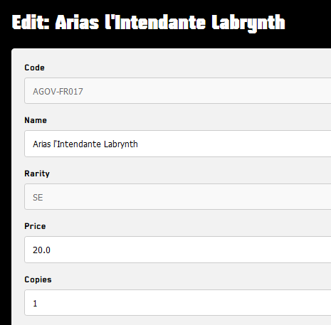
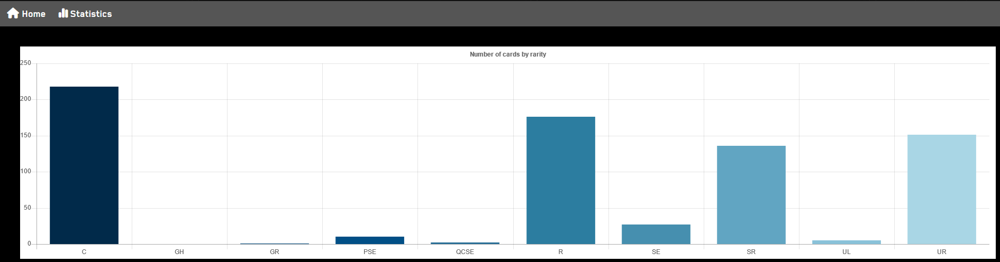

# An application to manage a card collection

## Table of contents

1. [Description](#description)
2. [Features](#features)
3. [How to use](#how-to-use)
4. [Demo](#demo)
5. [Tests](#run-tests)
6. [Folders](#folders)

## Description:

The goal of this app is to manage a card collection, no matter the game (YGO, MTG, ...).

## Features:

- Add cards (one by one and in bulk via a CSV file) :white_check_mark:
- Update card information :white_check_mark:
- Delete a card :white_check_mark:
- Calculation of collection value :white_check_mark:
- Show number of cards by rarity :white_check_mark:
- Add account connection and registration :white_check_mark:
- Search cards by code or name :white_check_mark:
- Show evolution of prices for the collection
- Show card image
- Sort cards by card attributes in ascending/descending order
- Track price of valuable or selected cards
- Database can support all TCG games

### How to use:

- `cd flask-app`
- Install the project: `pip install -e .`
- `cd flaskr`
- Create database: `flask --app flaskr init-db`
- Start local server: `flask --app flaskr run --debug`

## Demo:

### Home page

General informations:

List of cards:

Card edit (may change in the future):

### Statistics page

Cards by rarity:

## Run tests:

- `pytest -v`
- Measure code coverage: `coverage run -m pytest`
    - Results in terminal: `coverage report`
    - Results in HTML file: `coverage html`

## Folders:
- `flask-app`: Flask project
- `price-tracker`: Experimental scripts to track collection price
- `images`: images for documentation
- `doc`: documentation and diagrams
